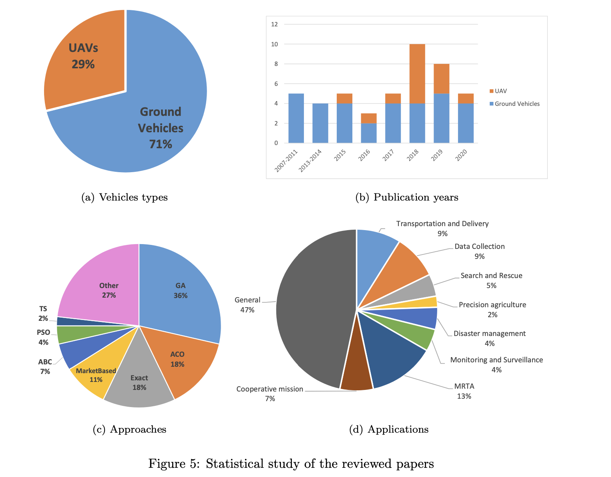
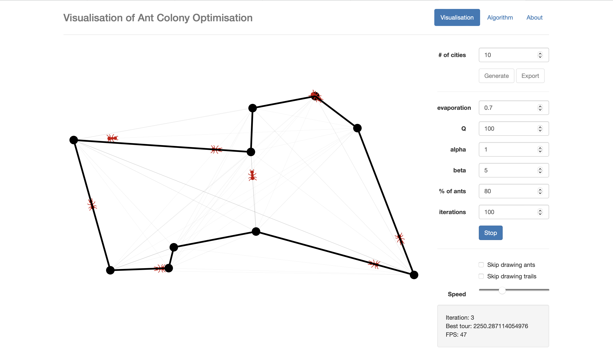
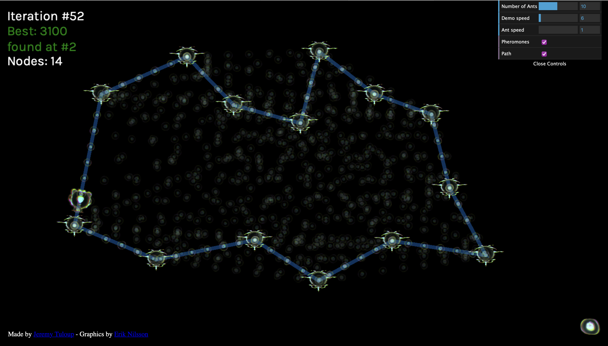
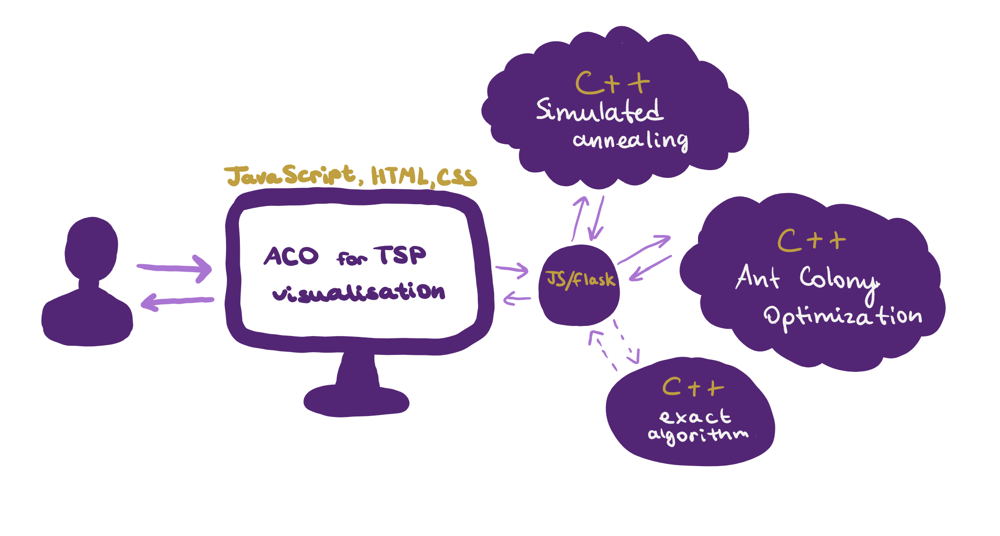

# ANALYSIS

## 1.1 What is the problem and why do I want to solve it?

The problem I want to solve is implementing 3 algorithms such as **Ant Colony Optimization(ACO)**, **Simulated Annealing(SA)** and an **Exact Algorithm(EA)** to compare their solutions to the **Travelling Salesman problem (TSP)** and create a visualisation in order to understand better how these algorithms work. **TSP** is a well-known optimization problem in combinatorial computer science. The TSP has the following statement:

> Given a list of cities and the distances between cities (weighted graph), what is the shortest route that visits each city exactly once and returns to the starting city?

The problem has important practical applications in real world, such as optimizing delivery routes, reducing travel costs, and improving resource allocation. I want to solve this problem because it is a challenging and intellectually stimulating problem, important in theoretical computer science, and I'm very interested in solving challenging theoretical computer science problems. Also, this allows me to explore biology inspired optimization algorithms and research further into a specific algorithm such as ACO.

Moreover, the Travelling Salesman Problem is an NP-hard (nondeterministic polynomial time) problem; in simple words, there is no algorithm that can find the exact solution in a relatively short time, and most probably there will never be. The only way to solve the Salesman Traveling problem for large problem sizes is to find an approximate solution. However, by developing my method of solving the TSP with the use of ACO, I can surpass the efficiency and accuracy of existing algorithms and make a real contribution to theoretical computer science, and this part really excites me.

Also, I want to build a visualization of the algorithms, so that it is easier to understand how they work for people who have no background in optimizational computer science. Furthermore, this visualization can then become a powerful learning tool for students who want to specialize in this field.

## 1.2 Interview with a primary user

When it comes to developing and implementing complex algorithms such as ACO, it's always nice to have friends who has expertise in the field and can give you a piece of valuable advice. Luckily, I have such friends, and I talked to them about implementing ACO for TSP, which was my initial idea and this is the feedback I got:

> Simulated Annealing is easier to set up for Travelling Salesman Problem and usually requires less iterations, so it would be interesting to compare it to the Ant Colony Optimization.

> If you are going to implement ACO, you should compare it to other algorithms. Simulated Annealing is an algorithm that is really easy but works well periodically for some reason. Ants will probably work better for TSP, but there Simulated Annealing is a good competition.

So after hearing the exact thing twice from different people, I got interested in Simulated Annealing and decided to include it in my NEA project.

My primary user is a decision maths teacher from my school, Ms. Sharp.

> Why is Travelling Salesman Problem important in decision mathematics and where can we use it practically?

Lots of real world applications – most businesses need to move products, services or people between several different places, and using the most efficient route possible can save a lot of time and money, meaning that the business could reduce prices and increase profit.

> When students learn about TSP and similar problems, what do they usually find difficult?

Following instructions precisely can be difficult, especially when students are experienced mathematicians who are used to choosing their own methods and applying their own ideas. Some algorithms are quite similar to others – e.g. nearest neighbour is starts a bit like Prim’s. The idea of lower bounds can be confusing, especially as we want the highest possible lower bound and the lowest possible upper bound.

> Have you seen any tools or resources that help students learn about TSP effectively? What was good or not so good about them?

The Dr Frost powerpoint is quite helpful but there can be a lot to take in on every page. I’m not aware of much else, other than textbooks.

> I'm going to create a visualisation of 2 algorihtms that solve TSP - Ant Colony Optimization and Simulated Annealing. Should the visualization tool provide a detailed, step-by-step explanation of how they work, or should it focus on giving an overall idea??

I would want a visualisation to show me each step of the algorithm, telling me what is being done and what doing the step has achieved. A brief explanation of how/why it works would also be helpful (not essential), but too much detail would probably be a distraction. This would enable students to use the visualisation independently to practice carrying out the algorithm, but a teacher could also show it to a class, adding more detail alongside each step as necessary.

> Do you think students should be able to change input parameters of the algorithms like the number of ants or evaporation rate in the visualization tool? Why or why not?

Yes, I think so. Trying algorithms out with different inputs can give a clearer idea of how it works.

> When students can interact with a tool in real-time, do they learn better?

Yes, definitely – when you meet an algorithm for the first time, unless it’s a very simple one, you don’t really know what it’s doing until you actually start putting it into practice.

> Is there anything else you'd like to share about how the visualization tool can be useful in teaching decision mathematics? Any special requests or ideas?

Students need to be experienced at running through algorithms by hand, and on exactly what needs to be written down in exams, but using a visualisation means they can focus on understanding what’s happening and why, rather than on what they’re writing down, or on carrying out calculations for themselves. Without wanting to make things too complicated for you, I would like something that gave me options that you can turn on or off, e.g.

- Choose difficulty level of example
- Automatic inputs or choose own inputs
- Show either description of step only, or brief explanation as well

## 1.3 List of user requirements

Based on the interview with Ms. Sharp, here are the main user requirements I outlined:

- show each step of the algorithm, telling what is being done and what doing the step has achieved
- a brief explanation of how/why it works, but not too much detail
- enable changing input parameters (such as evaporation rate, number of ants, alpha, etc); trying algorithms out with different inputs can give a clearer idea of how it works
- interaction in real-time
- help students to understand what’s happening and why, rather than on what they’re writing down, or on carrying out calculations for themselves
- customization; ability to turn on and off some options to make it more or less complicated/advanced
- enable both automatic and own inputs

Also, advice from my friends

- Compare Ant Colony Optimization to Simulated Annealing

## 1.4 Background analysis

In this section I will provide background information about algorithms that are commonly used to solve TSP, with a focus on the Ant Colony Optimization algorithm, and its relevance in solving optimization problems.

There are many algorithms that can be used to solve TSP, the most common ones are:

1. **Exact algortihms**
   - *Work fast only on small problem sizes but guarantee the optimal solution.*
   - The time complexity is $O(n^2 \times 2^n)$
2. **Heuristic algorithms**
   - *Heuristic algorithms work fast on bigger problem sizes, but produce an approximate solution.*
   - The time complexity can range from $O(n^2)$ to $O(n^3)$ depending on the type of the algorithm.
3. **Genetic Algorithms**
   - *Work well on larger problem sizes and provide good approximate solutions.*
   - Genetic algorithms can be efficient in practice for large problem sizes but can vary based on the implementation and problem complexity.
4. **Ant Colony Optimization (ACO)**
   - *Well-suited for large problem sizes and often provide good approximate solutions.*
   - ACO's time complexity is generally moderate, but it can be influenced by the number of ants and iterations.
5. **Simulated Annealing**
   - *Works well on small to medium-sized problem instances and provides good approximate solutions.*
   - Simulated Annealing's time complexity depends on the number of iterations and the cooling schedule but is generally moderate for small to medium-sized instances.
6. **Reinforcement Learning**
   - *Potential to work on larger problem sizes, but efficiency depends on the complexity of the learning process.*
   - The time complexity of reinforcement learning algorithms can vary significantly depending on the specific approach, learning rate, and the complexity of the problem.
     ``

Exact algorthms simply check every route and choose the best. They are guaranteed to find the best possible solution, but the the time comlexity is exponential, so it increases vastly as the problem size increases. This means that they can only be used for small data instances (up to 10 cities on an average computer).

ACO is inspired by behavior of real-world ants and how they use pheromones to communicate with each other. For instance, ants use trail pheromones to help other members of their colony to navigate from the nest to the source of food, and then back to the nest.
ACO is a probabilistic technique that uses a multi-agent method (where agents are artificial ants) and simulates a colony of ants to solve complex optimization problems.

The way it works to solve TSP, is such that each artificial ant starts from a random city, and then constructs its path until it visits every single city, not visiting any city twice (in TSP it's possible to get from any city to any other city, so such path will always exist no matter what the previous ant's choices are). When an ant chooses an edge at each construction step, it's more likely to choose the edge with a higher pheromone level and heuristic value. When the ants finish their tour, the pheromone values of edges are updated. Firstly, all values are decreased by a certain percent, and then increased. The increase in pheromone value of a certain edge is proportional to the quality of the solutions that use tours to which it belongs. This is repeated until the algorithm finds an optimal solution.

SA is a combinatorial optimizational technique just like ACO. It's inspired by the process of annealing a metal or glass by raising it to a high temperature and then gradually reducing the temperature, allowing local regions of order to grow outward. In simulated annealing, the equivalent of temperature is a measure of the randomness by which changes are made to the best path, in order to minimise it. When the temperature is high, larger random changes are made, avoiding the risk of becoming trapped in a local minimum. And as the temperature decreases, the probability of accepting worse solution reduces exponentially, allowing the algorithm to converge towards an optimal or near-optimal solution.

The figure above is taken from
[Cheikhrouhou, O., Khoufi, I. (2021). A comprehensive survey on the Multiple Traveling Salesman Problem: Applications, approaches and taxonomy.](https://arxiv.org/pdf/2102.12772.pdf)
The first figure shows that ACO is being used to solve TSP in 18% of reviewed papers, same as Exact Algorithms. The most common algorithm appears to be GA (genetic algorithms), 36%. The figure also shows the range of applications of TSP from Transport and Delivery to Disaster Managing, the most common application is General.

## 1.5 Analysis of current systems

I will examine 2 visualisation of ACO for TSP open-source tools, compare them to gain insight into their strengths and weaknesses, and then apply this knowledge to developing my own project.

- **The first system is [visual-aco created in the University of Tartu](https://courses.cs.ut.ee/demos/visual-aco/#/visualisation)**

Visual-aco has a fairly simple and easy-to-understand design, I quite like how it shows the ants and the pheromone level of each edge. What is also great, that it allows us to look inside the algorithm and see what happens throughout each iteration, and it shows the number of iteration on the bottom right. The ants speed is adjustable and I would say that the range of speeds used is perfect for this kind of visualisation. Furthermore, all the parameteres of ACO such as the percentage of ants, evaporation, etc can be also adjusted that is useful for advanced users. The cities can be automaticaly generated on the website or exported. A very important thing is that you can fast-forward through the iterations by choosing to "Skip drawing ants".

| pros                            | cons                                         |
| ------------------------------- | -------------------------------------------- |
| simple design                   | limited user-friendliness for begginers      |
| shows ants and pheromone levels | limited control over city point manipulation |
| adjustable parameters           |                                              |

- **The second system is [Ant Colony Optimization Visualization for the Traveling Salesman Problem (aco-tsp)](https://jtp.io/2015/11/22/ant-colony-tsp-visualization.html)**

This system is more user-friendly than the previous one and has less functionality, so I would assume that it's not made for advanced users, but for users who want to gain basic insights into how ACO works. In terms of editing the city points, you can only add them yourslef by clicking on the screen or move existing ones. The biggest downside of this visualisation is that although pheromone levels can be seen, it's not possible to see how ants move thoughout iteration. Also, there is not much in terms of customization of ACO parameteres. In colnclusion, this visualisation has less features, but more intuitive design and therefore, is more user-friendly than the first visualisation.

| pros                  | cons                                      |
| --------------------- | ----------------------------------------- |
| intuitive design      | limited control over algorithm parameters |
| control over cities   | doesn't show how ants move                |
| perfect for beginners |                                           |

**The comparison table for both systems is below**

| feature                         | visual-aco                                                                   | aco-tsp                                                                              |
| ------------------------------- | ---------------------------------------------------------------------------- | ------------------------------------------------------------------------------------ |
| design                          | fairly user-friendly, but not so intuitive                                   | very user-friendly, intuitive design                                                 |
| target audience                 | advanced users                                                               | beginners                                                                            |
| customization of ACO parameters | can customize most of the main parameters                                    | only the number of ants is customized                                                |
| showing the ants                | lets you look at how ants move between cities                                | doesn't have this feature                                                            |
| pheromone levels                | shows pheromone levels                                                       | shows pheromone levels                                                               |
| adjustable speed                | ants speed is adjustable and fast forwarding through iterations is available | iterations speed is adjustable, only fast forwarding through iterations is available |

**Overall**, both systems provide great visualisation of Ant Colony Optimisation for Travelling Salesman Problem, however the first system has more functionality, and the second system has more intuitive design. I want to strike the balance between functionality and user-friendliness, drawing inspiration from both systems.

## 1.6 Table of objectives

1. **Explore the maths behind ACO and SA**
   *This is needed to implement ACO and SA in the next step*
2. **Implement ACO algorithm for TSP**

   1. should succesfully construct a route that visits each city and returns to the starting city
   2. should have input parameters that control its performance such as the number of ants, evaporation, iterations, etc.
   3. should return data about the best route after each iteration for the visualisation
   4. should be quick, efficient and accurate
3. **Implement Simulated Annealing**

   1. should succesfully construct a route that visits each city and returns to the starting city
   2. should have input parameters that control its performance such as initial temperature, alpha, etc.
   3. should return data about the best route, temperature, etc. after each iteration so that the visualisation can be created
   4. should be quick, efficient and accurate
4. **Implement an exact algorithm for TSP**
   *This algorithm should find the exact solution for TSP for smaller problem instances (for comparing to ACO and SA output)*

   1. should succesfully construct a route that visits each city and returns to the starting city and is the best possible route
   2. should return data about the best route and its cost
   3. should be a very efficient and fast implementation
5. **Create a visualisation of algorithms**
   *Create an informative and interactive interface that allows users with different level of expertise to interact with visualisation easily*

   1. visualisation of how the output of Ant Colony Optimization changes with each iteration
   2. visualisation of how the output of Simulated Annealing changes with each iteration
   3. make it possible to hide/show any visualisation
   4. provide the ability for users to customize ACO and SA parameters
   5. adjustable speed and pause functionality
   6. fast-forwarding through iterations
   7. showing important information such as the number of iteration, the best route and its length, and when it was found
   8. make it possible to generate cities, create cities via the interface
   9. show the exact best route found using an exact algorithm for smaller problem instances
6. **Link the algorithms and the visualisation**
   *Link the systems together so that the visualisation can be created*

## 1.7 Modelling. High level overview

1. **ACO Algorithm Implementation**. Implement the Ant Colony Optimization algorithm to solve the Traveling Salesman Problem
   **input**: cities and distances between them, the number of iterations, ACO parameters (such as evaporation, Q, alpha, etc)
   **output**: pheromone levels, ants' routes and the best route after each iteration
   **implementation**: Python has a variety of frameworks that can help to connect evrything together and it's relatively fast, which makes it a good choice for algorithms implementation
2. **Simulated Annealing Implemenation**. Implement the Simulated Annealing algorithm to solve the Traveling Salesman Problem
   **input**: cities and distances between them, SA parameters (initial temperature, Markov chains, alpha)
   **output**: the best route, temperature, acceptance probability after each iteration
   **implementation**: Python has a variety of frameworks that can help to connect evrything together and it's relatively fast, which makes it a good choice for algorithms implementation
3. **Exact Algorithm Implementation**. Implement an exact algorithm (Dynamic Programming) to find the optimal solution for smaller TSP instances (for comparison purposes).
   **input**: cities and distances between them
   **output**: the best route
   **implementation**: Python has a variety of frameworks that can help to connect evrything together and it's relatively fast, which makes it a good choice for algorithms implementation
4. **Visualization Creation**. Create an interactive visualization to show the algorithms' progresses and results
   **input**: user's actions
   **ouput**: interactive visualisation
   **implementation**: JavaScript, HTML, CSS
5. **Integration of Algorithm and Visualization**. Link the algorithms and the visualization together.
   **implementation**: Flask is a sensible option as it's very intuitive, I've used it before and the algorithms will be written in python
   

