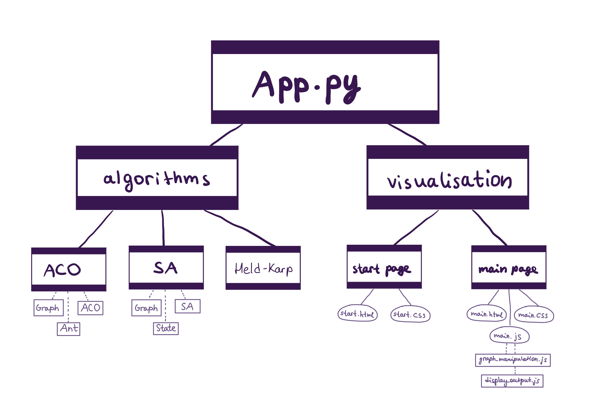
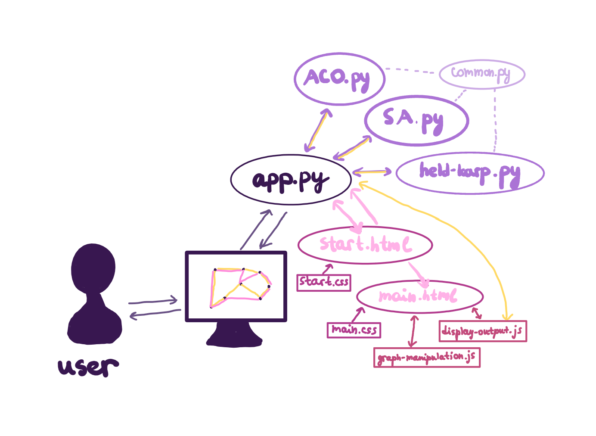
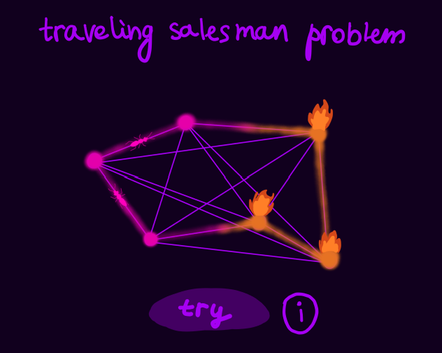
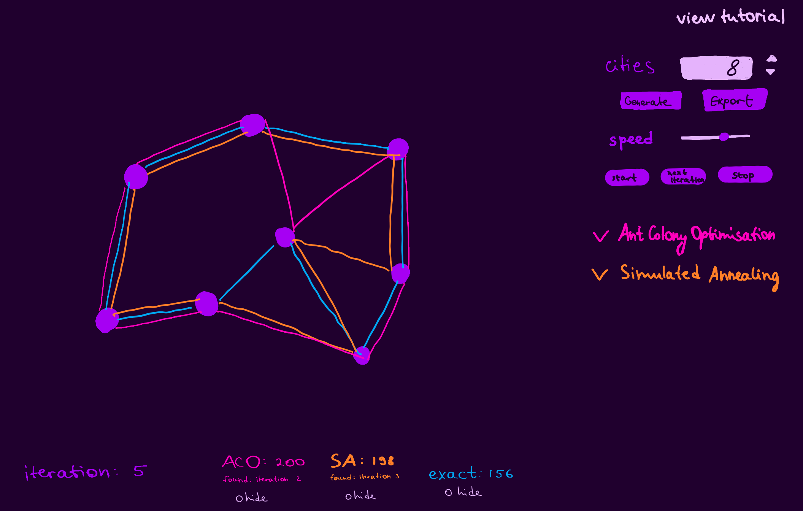

# DOCUMENTED DESIGN

## General overview

The program consists of 3 main part: app.py (local server coded in flask that connects front-end to back-end), algorithms and the user interface (visualisation). The top-down diagram is below:



and the data flow is following:



<div style="page-break-after: always;"></div>


## Visualisation design

The visualisation is a website with a start page (with a picture of a graph and a button "try"), a main page where users will be able to:

- create a graph (automatically or manualy)
- vary parameters to see how they affect the performance
- show/hide outputs of all algorithms
- choose if they want to see each iteration or fast-forward to see the answer straight away
- adjust the speed
- see outputs of all the other algorithms (inclusing the Held-Karp algorithm)

I plan to code all of this using the simplest tools and languages such as HTML, CSS, and JavaScript. For the purpose of sympifying the web designing, I'm going to use Bootstrap (just to make the website prettier). All of the other things like graph manipulation, and visulisation of algorithms outputs I plan to do from sctratch in JS.

### Start page

The design of the start page is below.



The graph symbolises ACO (in the form of ants on the left side) and Simulated Annealing (fire on the right side). The start page also contains a button "try", that will lead to the main page when pressed; and an additional information icon that will show some context and basic description of what the visualisation (additional information button is not decided yet).

### Main page



The main page has the following features:

- graph container, that displays nodes that can be either created by user (when user clicks inside the container), or generated (when generate button is pressed), or exported (this feature isn't decided yet as it may add extra complexity for users); nodes also can be moved with a mouse and deleted with a double click
- graph container, that shows the paths (outputs of algorithms) that change / or don't change after each iteration, aiming to find the optimal solution; different coloured paths represent different algorithms, and they can all be hidden/displayed by user with the help of hide checks at the bottom
- iteration number and algorithms outputs at the bottom, each showing the best cost yet, and iteration at which it was found
- user can adjust the speed of iteration, and also fast forward through the outputs and show the most optimal solution only
- when pressing on Ant Colony Optimisation or Simulated Annealing at the right, the accordition item will expand and let the user input the parameters of the according algorithm; for ACO: number of iterations, alpha, beta, Q, number of ants, evaporation rate; for SA: number of iterations, starting temperature, exponential decrease
- start button that starts/resumes visualisation when pressed; if any of parameters that should be inputed are empty ot not valid, it outputs an alert for the user.
- stop button that pauses/stops visualisation when pressed, so that no further changes are made to the algorithms outputs.

## Bringing it all together

Visualisation is only the small part of this project, and most of its significance are the optimisational algorithms. In order to display the outputs of the algotihms on the website, we need to pass all of the input parameters and variables to the algorithm implementation, and receive the outputs as a response.

At first I was going to implement algorithms in C++, because this way they would be as fast as they can get. But then, after a carefull consideration, I've changed my mind to Python mainly for its wider functionality. Python has frameworks like Flask (Web Application Framework), that can both run the website on itself, and connect front-end with back-end.

### Flask

Flask is a light framework, which means that it's fast and efficient. Furthermore, it's very easy to learn and understand it. For example this is code that returns "Hello world" when you navigate to https:/`<domain>`/hello_world

```
from flask import Flask
app = Flask(__name__)

@app.route('/hello_world')
def hello_world():
    return 'Hello World!'

if __name__ == '__main__':
    app.run()
```

My main file (app.py) will be written in flask, and it will have 3 routes:

- start page that is the one that is shown by default
- main page that is shown when "start" button is pressed
- calculate_outputs, that does not have ui itself, but can be sent requests to from js, and can then pass those parameters from the requests to algorithms that are also writen in python, and then outputs of those functions back to js -> user interface.

<div style="page-break-after: always;"></div>

## Algorithms

### Exact algorithm

There are different exact algorithms that can be used for solving TSP. I have chosen to use Held-Karp algorithm which is a dynamic approach with $O(n^2 \times 2^n)$ complexity, so it's more efficient than brute-force algorithms with $O(n!)$ complexity.
The main idea of Held-Karp is to compute the shortest tour length for all subsets of cities that end at a specific city. Here's the solution:

$dp[S][v]$ - the shortest path from $1$ to $v$ that visits all cities in subset $S$
at the start all $dp[S][v]=$&infin; and $dp[1][0]=0$ as the length of the path that visits the first city only is $0$

$dist[v1][v2]$ - the distance table

#### Pseudo code:

for $s$ from $2$ to $n-1$:

&nbsp;&nbsp;      for all $S$ &sube; {2,3,..,n} and $|S|$ = $s$:

&nbsp; &nbsp; &nbsp; &nbsp;         for all $v∈S$:

&nbsp; &nbsp; &nbsp; &nbsp; &nbsp; &nbsp;             $dp[S][v]$ = $min$ $(dp[S/v][u] + dist[u][v])$ (for all $u \neq v$, $u∈S$)

 $S = \{2, 3, ..., n\}$
min_dist = min over all $j$ in $S$:

&nbsp; &nbsp; $dp[S][j] + dist[j, 1]$

#### Explanation

This is a recursive algorithm that uses memoization technique. The base case is $dp[1][0]=0$. The algorithm calculates $dp[S][v]$ for $S$ of size $s$ after it did the same for all sets of size $s-1$. The shortest path from $1$ to $v$ that visits all cities in subset $S$ is equal to the minimum possible distance among all valid paths. To compute this, we consider all possible choices for the last city visited before reaching $v$. Let's denote this last city as $u$, where $u$ is an element of subset $S$, and $u ≠ v$.

1. We want to find the minimum distance from vertex 1 to v while visiting all cities in S, so we consider $dp[S\setminus\{v\}][u]$, which represents the shortest path from vertex 1 to u while visiting all cities in $S\setminus\{v\}$
2. To complete the path, we add the distance from u to v, denoted as $dist[u][v]$  in the algorithm. This distance represents the direct connection between u and v in the input graph.
3. The total distance is then $dp[S\setminus\{v\}][u] + dist[u][v]$
4. We calculate this value for all possible choices of u in S, and we choose the minimum of these values.

The solution to TSP is found by selecting the minimum distance among the paths that start at vertex 1, visit all cities exactly once, and return to the starting city which is $dp[S][j] + dist[j, 1]$, so we run a cycle for j to find it

#### Bitmasks

For this algorithm I'm going to use bitmasks. Bitmask is a binary number that represents a subset of a set. If the number has 1 at a point x (that is $2^x$ bit), then element number x in the superset is included in the subset.

**Example:**

4 3 2 1 0

1 0 0 1 1  = 16 + 2 + 1 = 19

So bitmask 19 represents a subset {0, 1, 4}

**Some binary operations in C++:**

1<<n - shift of 1, n times to the left

x\^y - x xor y

mask & (1<<x) - returns 1 if element x is in the subset represented by bitmask

mask ^ (1<<x) - bitmask that represents S\x

<div style="page-break-after: always;"></div>

### Ant Colony Optimization

**Ant Colony Optimization** is an algorithm inspired by ants` behavior. The main idea is to model an ant colony, where at every iteration:

1. **Route construction.** Each ant will choose a route that visits each city once. The probability of choosing an edge for the route is dictated by the pheromone level of that edge
2. **Compare**. The route of ants are compared to each other using a cost function (for TSP optimal route is the shortest route)
3. **Update**. Pheromone levels of edges are updated by at first decreasing them by a pecentage and then increasing proportionally to the quality of the routes to which a certain edge belongs.

So let's consider each step in more detail

#### Initializaion

Create artificial ants (number of ants is an input parameter)

Set pheromone levels to small random values

#### Route construction

Each ant starts at a random city

At each step it will choose the next city to be visited based on the probabilistic function:

$P_{ij}^{(k)}$ = $\frac{{(\tau_{ij}^\alpha) \cdot (\eta_{ij}^\beta)}}{{\sum_{l \in allowedCities} (\tau_{il}^\alpha) \cdot (\eta_{il}^\beta)}}$

$P_{ij}^{(k)}$ is the probability for ant k to move from city i to city j

 $\tau_{ij}^\alpha$ is the pheromone level of the edge from city i to city j.

$\alpha$ and $\beta$ are parameters that control the influence of pheromone ($\alpha$) and a heuristic function ($\beta)$ on ant decisions.

$\eta_{ij}$ is the heuristic information, which can be based for example on the distance between city i and city j.

The denominator represents the sum of probabilities for all allowed cities.

#### Comparison

$\Delta\tau_{ij}^{(k)}$ is a change in the pheremone level of the edge from i to j, contributed by ant k

$\Delta\tau_{ij}^{(k)} = \frac{Q}{L^{(k)}}$

where Q is a constant representing total amount of pheromon contributed by ants

$L^{(k)}$ is the length of the route constructed by ant k

#### Update

After all the routes were constructed, pheromone levels of each edge are updated using this formula

$\tau_{ij} \leftarrow (1 - \rho) \cdot \tau_{ij} + \sum_{k=1}^{\text{numAnts}} \Delta\tau_{ij}^{(k)}$

where evaporation (decreasing all pheromone levels by a certain percentage) is this part:

$\tau_{ij} \leftarrow (1 - \rho) \cdot \tau_{ij}$

and pheromone update (in simple words adapting the pheromone levels of edges to the "goodness" of edges) is this part:

$\tau_{ij} \leftarrow  \tau_{ij} + \sum_{k=1}^{\text{numAnts}} \Delta\tau_{ij}^{(k)}$

$\rho$ is the evaporation rate

$\Delta\tau_{ij}^{(k)}$ is a change in the pheremone level of the edge from i to j, contributed by ant k


<div style="page-break-after: always;"></div>


#### Pseudo code

> initialise artificial ants

> set pheromone levels to small random values

> for each iteration:
>
>>  for each ant:
>>
>>> choose starting city randomly
>>>
>>> while there are cities not in the route:
>>>
>>>> choose the next city that is not yet in the route randomly using the probabilistic function described in **Route Construction**
>>>>
>>>
>>> calculate the length of the ant's route
>>>
>>> calculate pheromone contribution as described in **Comparison**
>>>
>>
>> for each edge:
>>
>>> deacrease pheromone value by the evaporation rate
>>>
>>> add the ants' pheromone contibution as desrcibed in **Update**
>>>
>>
>> best solution = best(best solution, best ants' route in the iteration)
>>

> return best solution

#### Varying parameters

Number of ants, iterations, $\alpha$, $\beta$, $\eta_{ij}$, $Q$, $\rho$ are input parameters of ACO, so varying them can increase or decrease the algorithm performance, and they need to be tuned individually for each TSP problem instance.

We need to give the opporunity to change these parameters in UI so that users can explore how changing parameters may affect ACO performance.

<div style="page-break-after: always;"></div>

### Simulated Annealing

Simulated annealing is inspired by process of annealing in metallurgy when at first the temperature is raised to high temperature, and then gradually decreased. In Simulated Annealing, when the temperature is high, larger random changes are made, avoiding the risk of becoming trapped in a local minimum. And as the temperature decreases, the probability of accepting worse solution reduces exponentially, allowing the algorithm to converge towards an optimal or near-optimal solution.

#### Initializaion

At first a random solution to TSP is chosen as a current state, $s$; and the initial temperature, $T$, is set.

#### Iteration

At each iteration algorithm probabilistically decides wether to stay in the current state $s$, or move to a neighbour state $s*$.

If cost of $s*$ is less than cost of $s$, then $s*$ is accepted. Cost of a certain state is the price/length of the solution (aka length of the route)

If cost of $s*$ is bigger than cost of $s$ (new solution is worse), then $s*$ is accepted with probability $P$

$P = e^{-ΔC/T}$,

where $ΔC$ is $Cost(s*) - Cost(s)$ and $T$ is the current teperature and change is accepted if $P > random(0,1)$

This is repeated until the stopping critea is satisfied (such as the Temperature drops below Critical Temperature, or the maximum number of iteration is reached)


<div style="page-break-after: always;"></div>


#### Neighbouring states

In my implemetaton of Simulated Annealing I'm going to use three methods of state modification:

1. **Swap.** Swaping 2 random cities in a route
2. **Reverse.** Reversing a random segment
3. **Insertion.** Inserting a random city into a random place in te route

#### Cooling

There are two ways of decreasing Temperature in Simulated Annealing:

- Exponential. $T = \alpha * T$
- Linear. $T = T - ΔT$

I'm going to use exponential decrease as it usualy shows better results for Traveling Salesman Problem


<div style="page-break-after: always;"></div>


#### Pseudo code

> create a random solution

> for each iteration:
>
>> create a neighbouring state (randomly choose one of 3 modifications in **Neighbouring States**)
>>
>> if the cost of the neighbouring state is less than the cost of current state:
>>
>>> current state <- neighbouring state
>>>
>>
>> else:
>>
>>> accept the neighbouring state with the probability$P = e^{-ΔC/T}$, where `ΔC` is the change in cost
>>>
>>
>> cool the Temperature (T) exponentially as described in **Cooling**
>>
>> best solution = best(best solution, current state)
>>

> return the best solution

#### Varying parameters

Similar to Ant Colony, Simulated Annealing has parameters that can be varied such as initial temperature $T$, exponential decrease $\alpha$, number of iterations / critical temperature.

These parameters will affect Simulated Annealing perfomance on TSP, so we need to add the opprtuinity to vary them on the website for better understanding of the algorithm.

<div style="page-break-after: always;"></div>